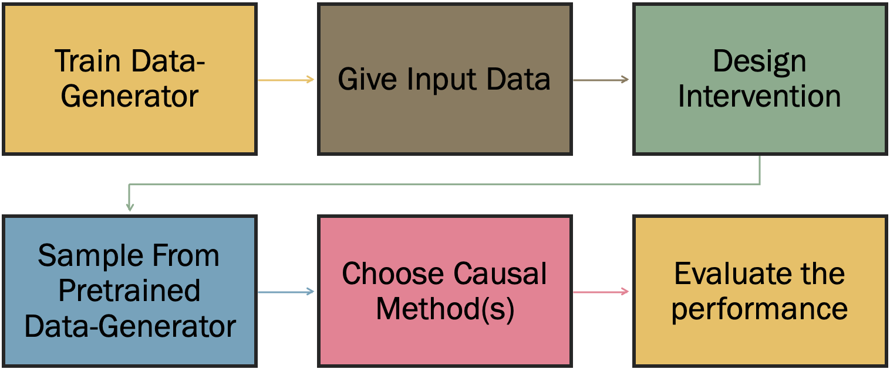

# CREDENCE -  Credence to Causal Estimates

**CREDENCE** is a framework that generates complex and realistic datasets with known treatment effects. These datasets can be used to measure the performance of causal inference methods as applied to a variety of problems.

This project began as a 2020 summer internship at Amazon in the Seller Partner Services Fees Science team, and is being extended and developed as part of an Amazon Post-Intern Fellowship.

### Premise.
Retrospective causal inference methods, like synthetic controls or difference in difference, are widely used to estimate the impact of an intervention where A/B testing is not an option: for example, fee changes or marketing campaigns. The causal effect of an intervention is the difference between the outcome under a treatment and the counterfactual outcome if an alternative treatment (or no treatment) was chosen. The main challenge in retrospective and non-experimental causal inference is that we only observe the outcome under one of the treatment choices while the counterfactual is never observed. Causal inference methods aims to re-create the scenario in which the alternative treatment was chosen i.e. estimating the counterfactual.

### Evaluation.
Traditional causal inference methods are typically evaluated in two ways: placebo tests and tests on simulated data. Placebo tests check that the treatment effect estimated by a particular method is zero during a period there is actually no intervention: in that situation, the actual should match the counterfactual. Testing on simulated data is limited because the data generative process is often simple and lacks the complexities of real world datasets where the method is actually applied. For applied researchers, the important question is understanding how well a method actually performs in realistic situations, not on a toy dataset.

### Framework.
In this project, we propose and develop a framework for generating complex and realistic datasets with known treatment effects. This approach combines the best parts of placebo tests and simulation tests: the simulated dataset would have as much complexity as the real world datasets used in placebo tests, but users would be able to control the treatment effect as well as the level of endogeneity like they do in simulation tests.

Thus, generated datasets can then be used to understand the performance of different causal inference methods on various metrics, allowing scientists to choose appropriate method for a given problem. Currently, we focus on causal inference with time-series data using synthetic control method(s).

CREDENCE uses a neural network based black-box data generative model called Autoregressive Variational AutoEncoder (AR-VAE), and an interpretable transformation map (ITM) to learn the distribution and sample dataset which have similar dynamics as the real datasets of interest. The AR-VAE model allows us to generate complex data while the ITM allows us to manipulate and intervene on the samples to encode treatment effects.

## Security

See [CONTRIBUTING](CONTRIBUTING.md#security-issue-notifications) for more information.

## License

This library is licensed under the CC-BY-NC-4.0 License.
